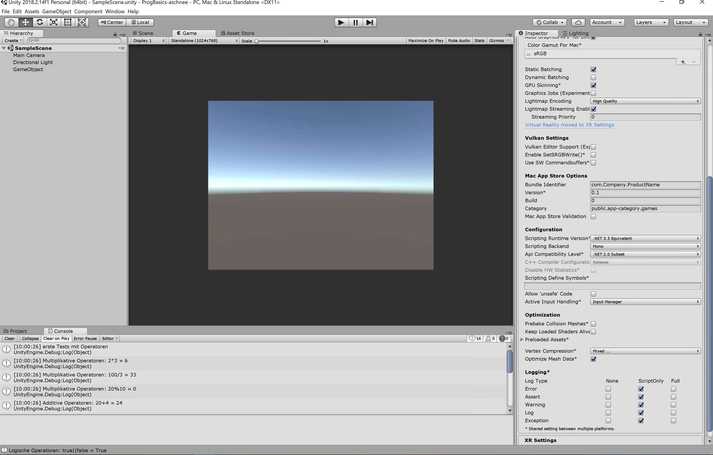

# ProgBasics-aschnee

**Operatoren Test** mit 
+Multiplikative Operatoren
+Additive Operatoren
+Relationale Operatoren
+Gleichheits Operatoren
+Logische Operatoren

+ **Progress:** 80%
+ **Status: ** 
	-not finished
	-experimenting with variables and methodes not done
	-test 2 string does not change its value
 
+ **Trailer:** 
+ **PLAY THE GAME HERE:** 
	- Game is not finished
+ **Development Platform:** 
	Unity 2018.2.14f1, 
	Visual Studio 15.9.4, 
	WIN, 
	Scripting Runtime Version .NET 3.5 Equivalent, 
	API Compatibility Level: .NET 2.0 Subset
+ **Target Platform:** 
	WebGL (Resolution: 1920*1080)

 
+ **Controles:** 

// 
+ **Resources:** 

- teaching materials by smers		
- All imagery by Alina Schneeberger, feel free to use
	

 
+ **Third party material:**
 //	

+ **Concept:
** 
	- experimenting with differnet kind of variables and methodes,as well as operators 
+ **In game Screenshots:**

+ **Limitations:
** //  
 
+ **Lessons Learned:
**   
	- How to work with operators  
	- How to work with   
	

Copyright by Alina Schneeberger, 2019
